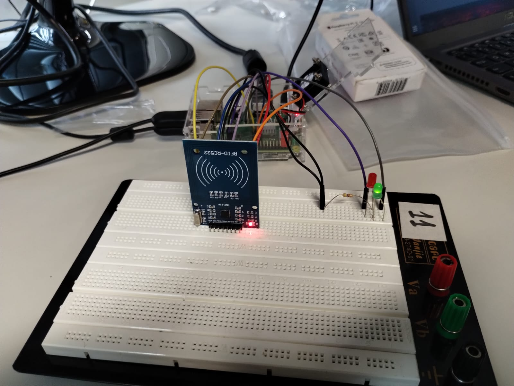
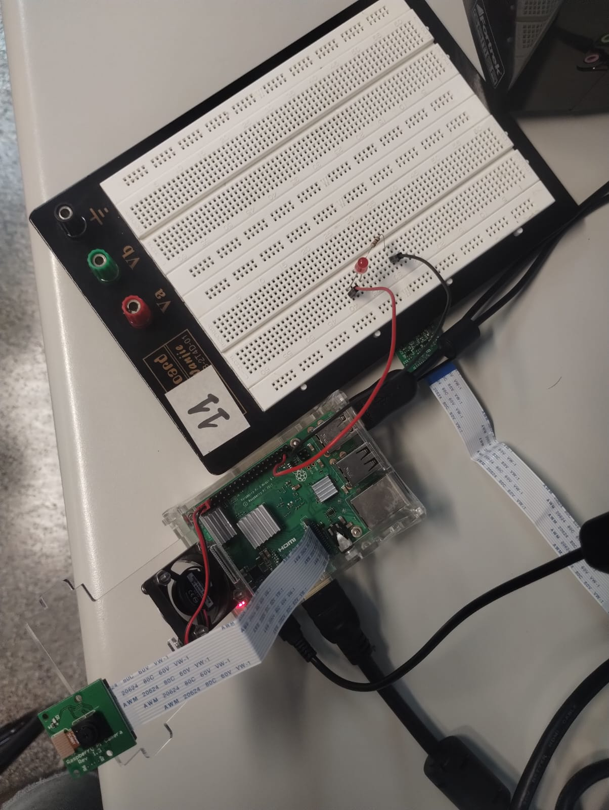

<h1> Prática 6 - SEL0337 </h1>

# Interfaces de Visão Computacional e Controle de Acesso via Tags (RFID)

## Montagem do circuito

Para o circuito do controle de acesso via tags, a montagem consistia apenas na conexão dos barramentos do leitor de RFID além de dois LEDs (um verde e o outro vermelho) em série com um resistor ligados às portas 20 e 21 (GPIO) respectivamente.

A montagem realizada está exibida na figura abaixo.

Já a montagem do sistema de Visão Computacional com identificação de rostos consiste apenas em um LED em série com um resistor (que acende quando um rosto é identificado) e a câmera conectada ao devido terminal. Essa montagem está na figura abaixo.

## Códigos

O arquivo mrfc_acesso.py é responsável pelo controle de acesso com as Tags RFID, com o uso da biblioteca mfrc522. Ela basicamente realiza a leitura com a função read() do objeto leitor, que é um SimpleMFRC522 (um type da biblioteca) e checa se o número de identidade é um dos números cadastrados.

Já o arquivo camera.py é responsável pelo reconhecimento de faces com o uso de classificadores Haar Cascade e um classificador já disponibilizado no arquivo haarcascade_frontalface_default.xml (fonte: [OpenCV](https://github.com/opencv/opencv/blob/4.x/data/haarcascades/haarcascade_frontalface_default.xml)), anteriormente treinado com uma base de dados.

### Funcionamento e modificações
Quando um rosto é identificado, o LED acende, é desenhado um quadrado verde ao redor do rosto e uma mensagem aparece dentro desse quadrado. Então, após um certo número de iterações sem que nenhum rosto seja identificado, o LED apaga. Além disso, no evento de uma detecção, a janela do frame que contem o rosto é salva em uma pasta designada.

Abaixo, vemos exemplos de fotos salvas imediatamente após a deteção.

**Mais detalhes podem ser encontrados nos comentários dos códigos presentes nesse repositório**